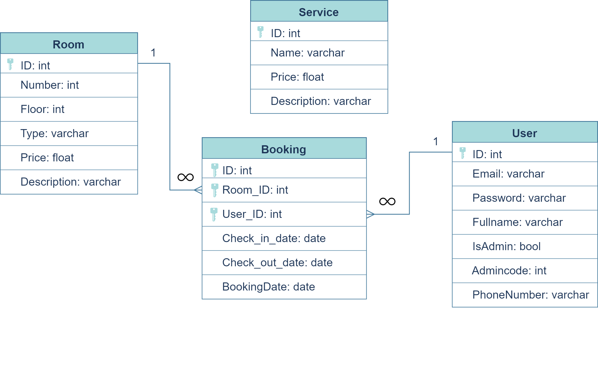

# course4Hotel
## Виконавець
Цей застосунок був створений у ході виконання курсового проєкту студенткою 45 групи спеціальності 121 ВСП 'ППФК НТУ 'ХПІ'' Жаботинською Софією    

## Суть застосунку
Метою роботи була розробка автоматизованої інформаційної системи для готелю. 
Для реалізації поставленої задачі використовувався фреймворк NET Multi-Platform App UI, мова програмування C#, мова розмітки XAML

В реалізації застосунку використовується архітектура Model-View-ViewModel або Mvvm. Всі класи, сторінки розподілені на моделі, подання,  моделі подання та сервіси.

## База даних
База даних застосунку розташована в хмарному середовищі Firebase, і має тип Realtime Database.
Дана база даних має містити такі таблиці: таблиця готельних номерів (Room), таблиця користувачів (User), таблиця для зберігання даних про сервіси готелю (Service), таблиця бронювань готельних номерів (Booking).

## Інструкція користувача

### Для гостя готелю:
1. Запускаємо програму. При запуску застосунку відкриється екран входу в акаунт.
2. Якщо немає акаунту в даному застосунку, то потрібно натиснути на кнопку «Зареєструватися». Відкриється екран реєстрації. Якщо акаунт наявний, то перейдіть до пункту 5.
3. Потрібно заповнити всі поля для успішної реєстрації. Для реєстрації користувача необхідне повне ім’я користувача, електронна пошта та телефон, створений пароль для входу.
4. Після заповнення полів, натисніть кнопку «Заєреструватися», програма знову відкриє екран входу. Якщо на етапі реєстрації ви згадали, що маєте акаунт, просто натисніть «Увійти» внизу екрану.
5. Введіть у поля свою електронну адресу та пароль. Якщо якесь з значень введено неправильно, то виведеться помилка. Спробуйте ще раз уважно ввести дані.
6. Після успішного входу в застосунок одразу відкриється екран перегляду ваших бронювань. Він може бути порожній або містити дані про всі ваші попередні бронювання, а саме: який номер бронювався, коли здійснювалось бронювання, дата заселення і дата виселення.
7. Внизу екрану розміщена навігаційна панель. За її допомогою можна перейти до екрану бронювання та екрану послуг.
8. Внизу екрану розміщена навігаційна панель. За її допомогою можна перейти до екрану бронювання та екрану послуг. 
9. При переході до екрану бронювання відкривається панель для введення дат. 
10. Виберіть за допомогою календаря дату вашого заселення та дату виселення та натисніть «Шукати».
11. Ви побачите всі доступні номери на задані вами дати.
12. Оберіть підходящий під ваші потреби номер та натисніть на кнопку «бронювати» справа кожної запропонованого номеру.
13. Коли кнопку натиснено, з’явиться вікно для підтвердження броювання. Тут можна перевірити дати і переглянути вартість перебування в готелі за цими термінами. Також можна побачити фото цього готельного номеру.
14. Після підтвердження бронювання, воно має з’явитися в списку ваших бронювань, тоді бронювання точно було здійснено. Якщо ви натиснули «скасувати» в вікні підтвердження, то, відповідно, ніякий змін не відбулось.
15. Остання вкладка в навігаційній панелі відповідає за замовлення послуг. Тут ви можете знайти потрібну послугу, переглянути її деталі та вартість замовлення такої послуги. 
16. Для замовлення послуги натисніть замовити під потрібною вам послугою. З’явиться повідомлення про підтвердження.
17. В будь-який момент ви можете здійснити вихід з акаунту. Дла цього натисніть на жовту кнопку вгорі і натисніть «вийти».

### Інструкція для адміністратора готелю:

1. Запускаємо програму. При запуску застосунку відкриється екран входу в акаунт.
2. Для входу в акаунт використовуєте ваші пошту та пароль.
3. Після успішного введення даних відкриється екран додаткової перевірки адміністратора. Введіть код адміністратора, який є актуальним на даний час.
4. Якщо все введено правильно, що відкриється екран редагування номерів. Тут можна переглянути всі номери, редагувати або видаляти їх, додавати новий номер.
5. Для додавання номеру натисніть «Додати кімнату».
6. З’являється форма для введення даних. Заповніть всі поля.
7. Натисніть «Зберегти». Форма закриється, а список номерів оновиться.
8. Для редагування номеру натисніть «Редагувати» напроти потрібного. З’явиться та ж форма, але поля будуть заповнені даними вибраного номеру для полегшення редагування. Для скасування редагування або додавання номеру просто згорніть форму.
9. Якщо необхідно видалити запис про готельний номер, натисніть «Видалити», після цього список номерів оновиться.
Для здійснення операцій над послугами, здійсніть перехід за допомогою навігаційної панелі. Відкриється екран послуг.
11. Для додавання, редагування та видалення послуг здійснюються аналогічні дії, що для операцій над готельними номерами.

## Скриншоти програми
